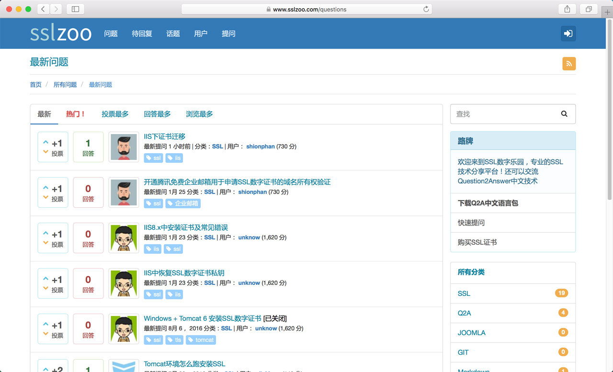

SSLZOO Theme
===

This theme base on [Dount](https://github.com/amiyasahu/Donut) for Question2Answer 1.7.x. Thanks for [amiyasahu](https://github.com/amiyasahu).

## Demo

Visit http://www.sslzoo.com

## Required plugin

* [Dount-admin](https://github.com/amiyasahu/Donut/tree/master/qa-plugin/Donut-admin)
* [q2a-breadcrumbs](https://github.com/amiyasahu/q2a-breadcrumbs)
* [q2a-ckeditor](https://github.com/shionphan/q2a-ckeditor)

## Usage

Place this folder under qa-theme directory of your q2a installation path, just like Dount.

1. [Install Question2Answer](http://www.question2answer.org/install.php). This theme requires at latest version 1.7 (see the change log for details)
2. Copy the Donut-admin folder to qa-plugin directory of your q2a installation (eg. qa-plugin/Donut-admin)
3. Copy the sslzoo folder to qa-theme directory of your q2a installation (eg. qa-theme/Donut-theme)
4. Visit http://your-q2a-site.com/admin/donut-theme/general-settings for configuring the theme as per your taste
5. Visit http://your-q2a-site.com/admin/general , select the sslzoo for both the Site theme and Theme for mobile

## License

This program is free software; you can redistribute it and/or modify it under the terms of the GNU General Public License as published by the Free Software Foundation; either version 2 of the License, or (at your option) any later version.

## 中文译包

* [SSLZOO Q2A定制中文语言包](https://github.com/shionphan/q2a-simplified-chinese)
* [q2a-breadcrumbs 中文语言包](https://github.com/shionphan/q2a-breadcrumbs-simplified-chinese)

## 中文说明

1. 安装Question2Answer 1.7.x
2. 下载 [Dount-admin](https://github.com/amiyasahu/Donut/tree/master/qa-plugin/Donut-admin)、[q2a-breadcrumbs](https://github.com/amiyasahu/q2a-breadcrumbs)、[q2a-ckeditor](https://github.com/shionphan/q2a-ckeditor) 插件，需要的话下载上述中文语言包
3. 复制Dount-admin到qa-plugin目录下
4. 复制本主题sslzoo到qa-theme目录下
5. 访问你的网站 http://your-q2a-site.com/admin/donut-theme/general-settings 设置
6. 访问你的网站 http://your-q2a-site.com/admin/general 设置sslzoo主题作为网站主题、移动端主题
7. 修改LOGO，修改文件 /theme/less/components/headder.less ，然后编译 /theme/sslzoo/css/sslzoo.less 输出为 /theme/sslzoo/css/sslzoo.less 即可
8. 编辑器使用的是ckeditor定制版，直接将插件 q2a-ckeditor 中的 wysiwyg-editor 覆盖 /qa-plugin/wysiwyg-editor （改了皮肤和部分功能）

## 授权

我也是搬运加修改，可以横竖随意用，自觉遵守吧，创造一个比较良好的开放环境是祖国的希望。
